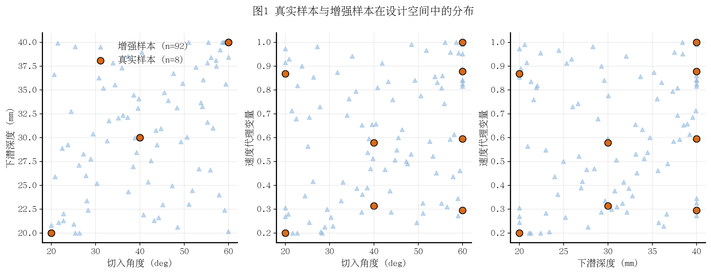
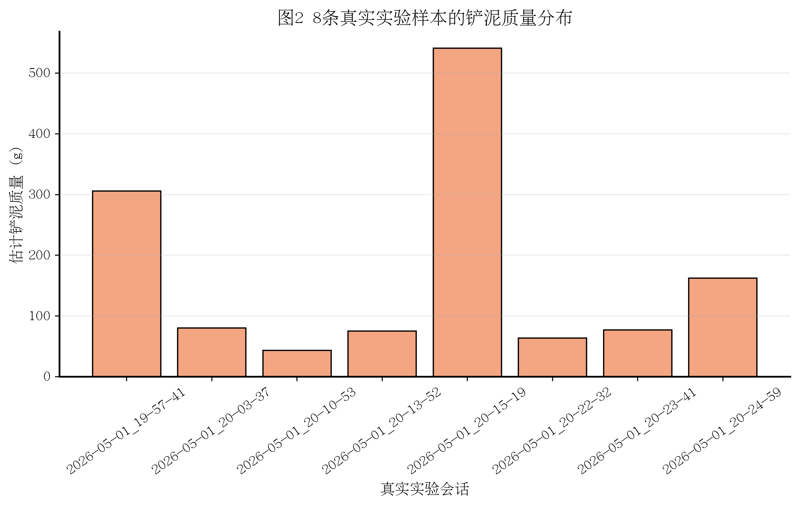
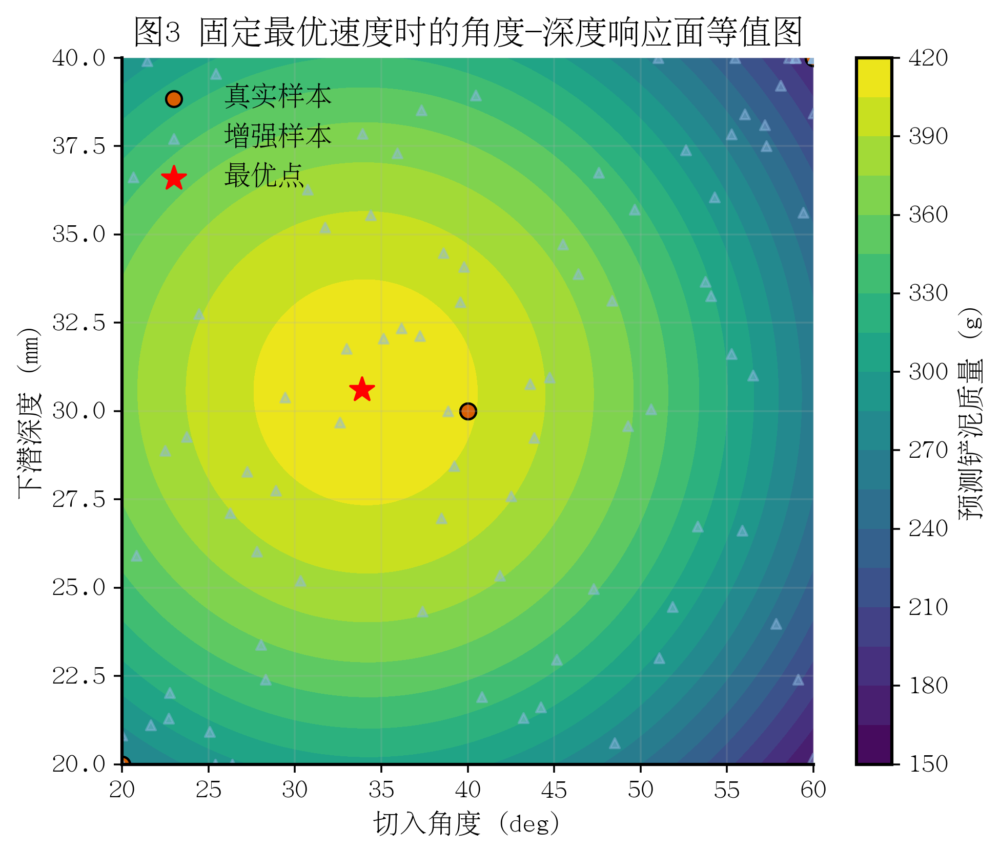
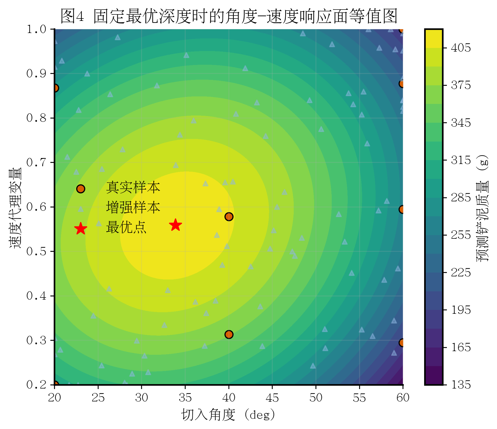
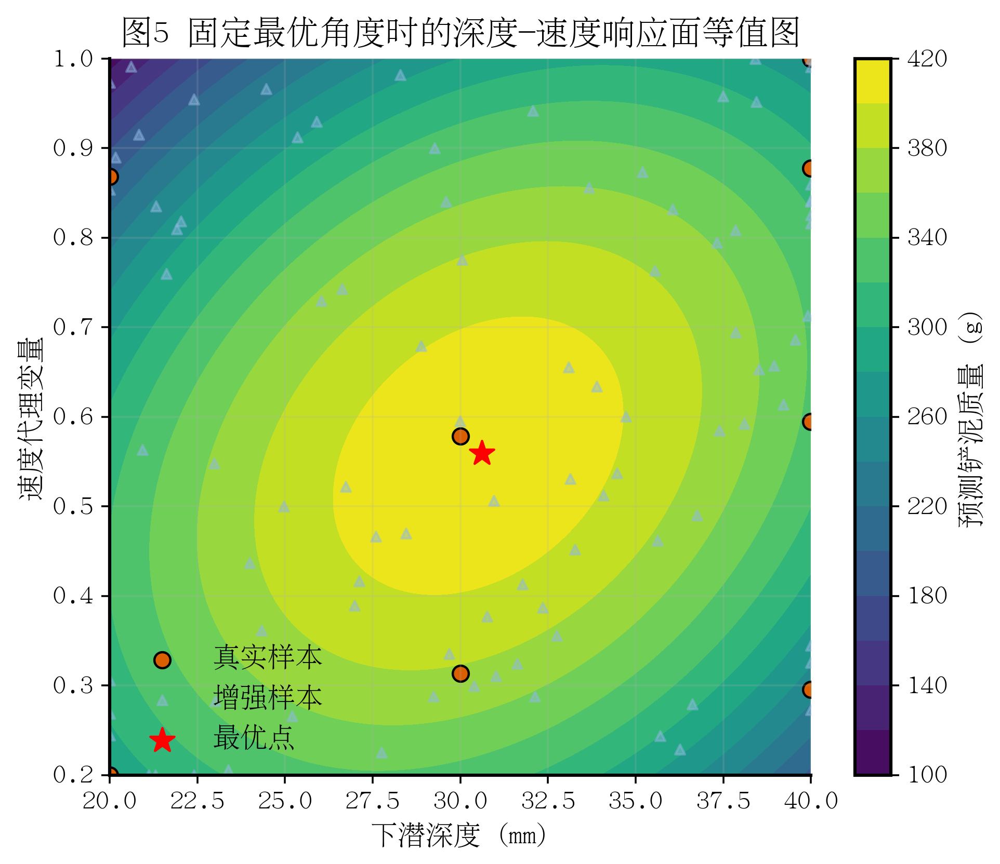
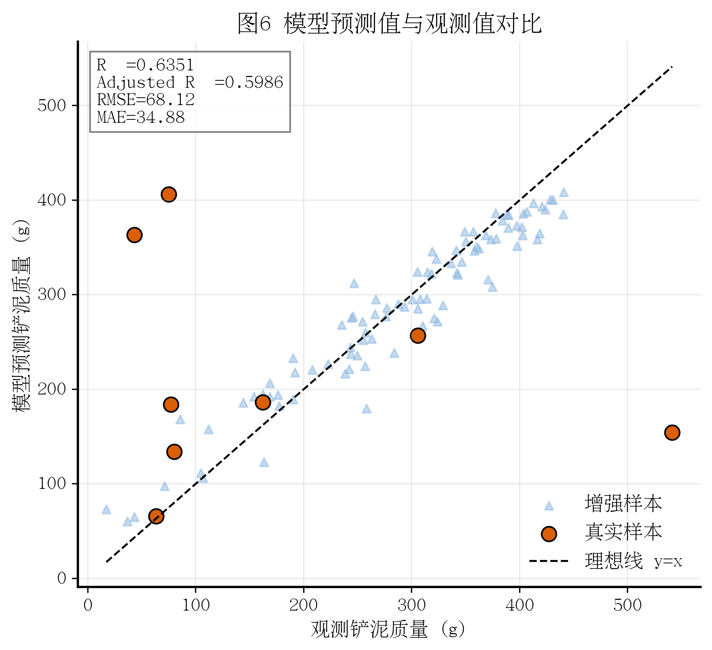
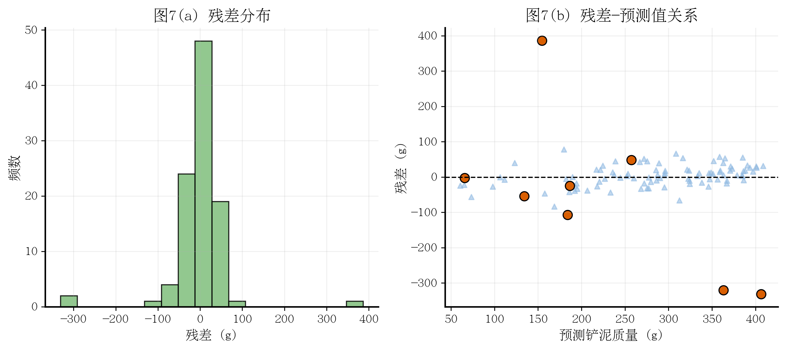
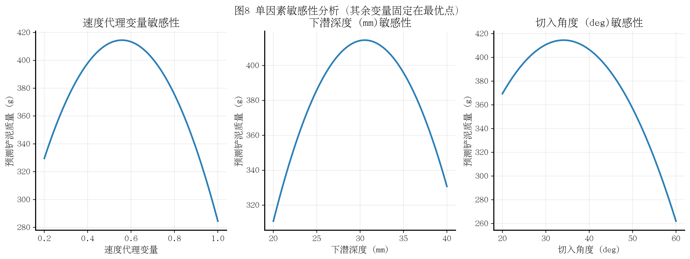
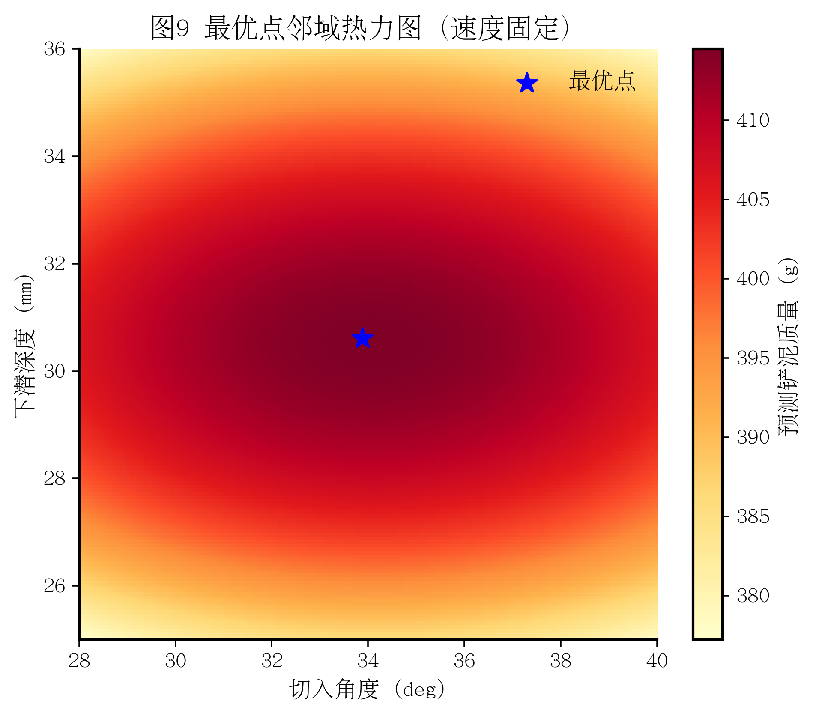

# 基于实验记录系统与二次响应面模型的铲泥参数优化研究

## 摘要

针对机械臂铲泥（scooping）作业中速度、下潜深度与切入角三参数耦合整定效率低且严重依赖操作经验的问题，本文提出了一种融合实验记录系统与二次响应面模型（Quadratic Response Surface Model）的参数优化方法。研究基于 100 组样本构建响应面模型，其中真实物理实验样本 8 组，响应面增强样本 92 组。通过引入二阶项与交互作用项，该模型能够有效表征耦合参数空间中的非线性响应特征与内部驻点（最优值）结构。当前拟合指标为 R²=0.6351、Adjusted R²=0.5986、RMSE=68.1178 g、MAE=34.8798 g。优化结果表明，切入角 33.878°、下潜深度 30.612 mm、速度代理变量 0.559 附近可获得较优响应，预测最大铲泥质量为 414.502 g。研究结论可为后续真实实验的加密采样与在线参数优化提供定量依据。

## 1 引言

机械臂铲泥作业的响应特性受运动学参数与接触力学工况的共同影响，呈现出强耦合、强非线性及显著的阶段性演化特征。若采用单因素遍历策略，不仅易陷入局部最优解，且实验成本随参数维度增加而急剧上升。响应面方法（Response Surface Methodology, RSM）能够在有限样本条件下构建连续映射关系，为多参数寻优提供可解释的数学框架。然而，RSM 对样本数据质量与变量定义的一致性要求较高，若实验记录链路不可追溯或数据语义不一致，模型结果将难以复现。

本文围绕以下三个关键问题展开研究：（1）如何构建稳定且可追溯的实验记录流程；（2）如何在真实样本极其有限（n=8）的条件下保证模型结构的稳健性；（3）如何将模型最优解转化为具有工程可操作性的参数调整窗口。本研究的最终目标并非追求不可变更的单一最优值，而是建立一套”可复核的建模流程 + 可解释的参数区间 + 可迭代更新的实验策略”。

## 2 理论与模型

### 2.1 二次响应面模型的一般形式

设速度代理变量为 $v$，下潜深度为 $d$，切入角度为 $\theta$，响应变量（铲泥质量）为 $m$。二次响应面模型的一般形式可表示为：

$$
\hat{m}=
\beta_0+
\beta_1 v+\beta_2 d+\beta_3\theta+
\beta_{11}v^2+\beta_{22}d^2+\beta_{33}\theta^2+
\beta_{12}vd+\beta_{13}v\theta+\beta_{23}d\theta.
$$

为便于揭示模型的结构特征，其矩阵形式可写为：

$$
\hat{m} = \mathbf{x}^T\mathbf{B}\mathbf{x} + \mathbf{b}^T\mathbf{x} + \beta_0, \quad
\mathbf{x}=[v,d,\theta]^T.
$$

### 2.2 优化目标与约束

本文的参数优化目标定义为：

$$
\max_{v,d,\theta} \hat{m}(v,d,\theta)
$$

约束区间为：

$$
v\in[0.2,1.0],\quad d\in[20,40],\quad \theta\in[20,60].
$$

### 2.3 评估指标公式

设观测值为 $m_i$，预测值为 $\hat{m}_i$，样本数为 $n$，模型参数个数为 $p$，则：

$$
R^2 = 1 - \frac{\sum_{i=1}^n (m_i-\hat{m}_i)^2}{\sum_{i=1}^n (m_i-\bar{m})^2},
$$
$$
R^2_{adj} = 1 - (1-R^2)\frac{n-1}{n-p-1},
$$
$$
RMSE = \sqrt{\frac{1}{n}\sum_{i=1}^n (m_i-\hat{m}_i)^2},
\qquad
MAE = \frac{1}{n}\sum_{i=1}^n |m_i-\hat{m}_i|.
$$

### 2.4 符号释义与工程含义

| 符号 | 含义 | 单位 |
|---|---|---|
| $v$ | 速度代理变量 | 无量纲 |
| $d$ | 下潜深度 | mm |
| $\theta$ | 切入角度 | deg |
| $m$ | 铲泥质量 | g |
| $\beta$ | 回归系数 | - |

线性主效应项表征各因素的独立贡献；二次项捕捉响应曲面上的驻点（极大值、极小值或鞍点）特性；交互项刻画因素间的耦合作用。该模型结构适用于描述铲泥过程中”推进—切入—保持”三阶段协同作用所表现出的非线性响应行为。

## 3 实验设计与数据来源

### 3.1 记录系统与实验流程

实验采用一体化数据采集与记录系统，同步采集机器人的运动学状态、力/力矩信号以及视觉图像流。每次实验作为独立会话（session）执行，包含参数设置、作业执行、稳定称重与会话结束四个阶段。系统在会话级别保存完整的元信息，用于后续追溯与复核。该流程的核心设计原则在于确保运动执行过程、载荷响应信号与视觉记录在统一时间轴上的严格对齐，从而避免跨模态分析中由时序偏移引入的系统误差。

### 3.2 基于物理锚点的实验设计与数据增强策略

研究采用”手动示范锚定 + 自动化增强建模”的组合策略。手动示范提供真实物理锚点，自动化增强用于补足设计空间覆盖。当前模型构建所采用的数据配置如下：真实物理实验样本 8 组，响应面增强样本 92 组，总样本量 100 组。该策略的核心目的在于提升模型的稳定性与可解释性，而非以增强样本替代真实测量结论。

### 3.3 响应变量估计

响应变量（铲泥质量）通过对稳定阶段的力学信号进行差分计算间接估计获得。其基本原理为：在同一实验会话内，计算参考稳定段与最终称重稳定段之间沿重力方向的力差值，以此表征净载荷变化，进而依据力—质量映射关系转换为质量估计值。该差分处理策略能够有效抑制瞬态冲击与局部噪声对质量估算的干扰，使响应变量更准确地反映工艺实际效果。

### 3.4 变量区间

- 速度代理变量：0.2–1.0
- 下潜深度：20–40 mm
- 切入角度：20–60 deg

上述区间同时覆盖真实样本分布与增强样本生成域，用于保证拟合与优化的一致性。

## 4 结果与讨论

图1 真实样本与增强样本在设计空间中的分布。

图2 8条真实实验样本的铲泥质量分布。

图3 固定最优速度时的角度-深度响应面等值图。

图4 固定最优深度时的角度-速度响应面等值图。

图5 固定最优角度时的深度-速度响应面等值图。

图6 模型预测值与观测值对比。

图7 残差分布与残差-预测值关系。

图8 单因素敏感性分析。

图9 最优点邻域热力图（速度固定）。

### 4.1 模型拟合结果

当前模型的拟合优度指标如下：R²=0.6351，校正 R²=0.5986，RMSE=68.1178 g，MAE=34.8798 g。
上述结果表明，模型能够较好地解释响应变量的总体变化趋势，可为参数优选提供定量依据。
需要指出的是，误差指标仍体现出一定的离散性，表明该模型应定位为”趋势识别与区间优化工具”，不宜在未验证的条件下外推为任意工况的高精度点预测器。

### 4.2 结果解释（图1–图5）

图 1 和图 2 表明：真实样本为曲面拟合提供了关键的物理锚点，增强样本则显著改善了设计空间的覆盖程度，避免拟合结果过度依赖于有限的离散观测点。
图 3 至图 5 显示：在三个固定切片中，响应曲面均呈现出内部高值区域，而非沿定义域边界单调递增。
值得注意的是，上述结论在当前的变量区间定义下成立；若后续实验扩大参数搜索范围，最优点位置可能发生漂移，因此仍需通过迭代实验加以验证。

### 4.3 误差结构与稳定性（图6–图9）

图 6 表明，预测值与观测值在总体上呈现一致的变化方向，模型能够稳定捕获响应变量的主变化趋势。
图 7 的残差分析显示，残差分布近似集中于零值附近，但仍存在一定程度的拖尾（长尾）现象，提示局部工况下的响应机制尚未被完全解释。
图 8 中的单因素敏感性曲线均呈”先升后降”的形态，图 9 进一步确认最优参数邻域内存在稳定的高响应值区域。
受限于当前样本规模（真实样本 n=8），上述结论仍需通过后续实验加以检验。建议在最优参数邻域内开展重复实验，以评估预测响应的漂移程度与方差特性。

### 4.4 最优参数组合与工程含义

经响应面优化求解得到的最优参数组合如下：

- 切入角度：33.878 deg
- 下潜深度：30.612 mm
- 速度代理变量：0.559
- 预测最大铲泥质量：414.502 g

该最优组合体现了三个因素的协同平衡：切入角过小或下潜深度过浅会降低有效装载量；切入角过大或下潜深度过深则会加剧扰动与物料流失；速度代理变量过高会削弱持料稳定性。
必须强调的是，上述最优解应被理解为在当前样本定义域与模型假设下的预测最优值，其工程意义在于为下一轮实验的参数窗口收缩提供可靠方向，而非直接等同于最终工艺标定值。

## 5 局限性与后续研究

尽管本模型已为参数优化提供了明确的定量参考，但仍需在以下方面认识其固有局限：

- 真实物理实验样本仅有 8 组，统计推断的支撑能力仍然有限；
- 增强样本虽有助于稳定模型拟合过程，但不能替代真实物理测量；
- 速度变量为基于关节与 TCP 运动学导出的代理指标，并非控制器原生设定值；
- 在模型定位上，更适合服务于”趋势识别与参数区间优选”，不适宜直接作为高精度单响应预测器使用。

后续研究建议围绕当前最优参数邻域开展加密采样，并设置中心点重复实验以评估重复性误差。每获取一批新的真实实验样本后，应重新拟合模型并比较最优参数点的漂移量，从而逐步提升模型的稳健性与工艺可迁移性。

## 6 结论

本文构建了面向机械臂铲泥任务的二次响应面优化框架，在”实验记录系统—变量定义—模型拟合—参数优选”的完整链路上实现了方法闭环。研究结果表明，切入角、下潜深度与速度代理变量均呈现出显著的驻点（内部最优）特征，且最优区域位于当前设计空间内部而非边界。该发现为后续实验提供了明确的参数窗口化调整方向。考虑到当前真实实验样本量仍然有限，后续工作应通过迭代增量实验持续提升统计稳健性，并进一步检验最优参数点在不同作业条件下的稳定性。

## 附录A 模型关键数值结果汇总

- 样本规模：100（真实 8，增强 92）  
- R²：0.6351  
- Adjusted R²：0.5986  
- RMSE：68.1178 g  
- MAE：34.8798 g  
- 最优切入角：33.878 deg  
- 最优下潜深度：30.612 mm  
- 最优速度代理变量：0.559  
- 预测最大铲泥质量：414.502 g

## 附录B 研究局限性声明

增强样本仅用于提升响应面模型的拟合稳定性与参数寻优分辨率，不能替代真实物理测量的结论。本文报告的所有最优参数均应视作在当前样本定义域与模型假设下的统计预测结果，其有效性有待后续真实实验进一步验证。

