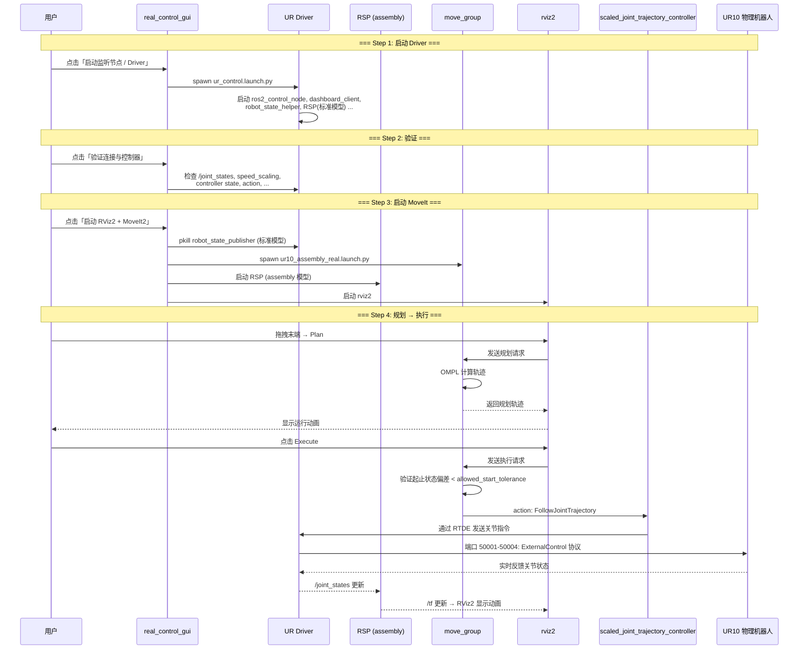

# UR10 实机控制系统架构

## 总览

本系统通过 **WSL2 → Windows 端口转发 → UR10 物理机器人** 的链路，实现 ROS2 Humble 对真实 UR10 机械臂的轨迹规划与执行控制。核心是一个 PyQt5 GUI 启动面板，按顺序启动监听驱动、验证连接、加载 MoveIt/RViz2。

---

## 节点关联图 (Mermaid)

```mermaid
%%{init: {'theme': 'base', 'themeVariables': { 'fontSize': '14px', 'primaryColor': '#e0f0ff', 'lineColor': '#333'}}}%%
graph TB
    subgraph "物理层"
        UR10["UR10 本体<br/>示教器 + ExternalControl"]
    end

    subgraph "WSL2 / ROS2"
        subgraph "Step 3 (MoveIt)"
            MOVE_GROUP["move_group<br/>moveit_ros_move_group"]
            RSP_ASSEMBLY["robot_state_publisher<br/>(assembly 模型)"]
            RVIZ["rviz2<br/>MoveIt MotionPlanning 插件"]
        end

        subgraph "Step 1 (Driver)"
            ROS2_CTRL["ros2_control_node<br/>controller_manager"]
            DASHBOARD["dashboard_client<br/>ur_robot_driver"]
            STATE_HELPER["robot_state_helper<br/>ur_robot_driver"]
            URSCRIPT_IF["urscript_interface<br/>ur_robot_driver"]
            STOPPER["controller_stopper"]
            TRAJ_UNTIL["trajectory_until_node"]
            RSP_DRIVER["robot_state_publisher<br/>(标准 UR10 模型)<br/>⚠️ 被 pkill 杀掉"]
        end

        subgraph "控制器实例 (由 controller_manager 管理)"
            JSB["joint_state_broadcaster"]
            SJS["speed_scaling_state_broadcaster"]
            IO_CTRL["io_and_status_controller"]
            FT_BC["force_torque_sensor_broadcaster"]
            TCP_BC["tcp_pose_broadcaster"]
            UR_CFG["ur_configuration_controller"]
            FRICTION["friction_model_controller"]
            SCALED_CTRL["scaled_joint_trajectory_controller<br/>✓ 用于执行"]
            JT_CTRL["joint_trajectory_controller<br/>(spawned inactive)"]
        end

        subgraph "GUI (启动管理)"
            GUI["real_control_gui.py<br/>PyQt5 启动面板"]
        end

        subgraph "验证与诊断"
            VERIFY_SH["check_real_ur10_ready.sh"]
            DIAG_CMD["诊断执行状态<br/>(内嵌 bash 脚本)"]
        end
    end

    subgraph "Windows 宿主机"
        PORTPROXY["netsh portproxy<br/>50001-50004"]
    end

    %% 物理连接
    UR10 <-->|"端口 50001-50004<br/>ExternalControl URCap"| PORTPROXY
    PORTPROXY <-->|"WSL 内核对等转发"| ROS2_CTRL

    %% Driver 内部连接
    ROS2_CTRL -->|"publish /joint_states"| JSB
    ROS2_CTRL -->|"publish /speed_scaling"| SJS
    ROS2_CTRL -->|"service dashboard/..."| DASHBOARD
    DASHBOARD -->|"service 调用"| STATE_HELPER
    ROS2_CTRL -->|"控制器生命周期"| SCALED_CTRL
    ROS2_CTRL -->|"控制器生命周期"| JT_CTRL
    ROS2_CTRL -->|"controller_manager"| IO_CTRL
    ROS2_CTRL -->|"controller_manager"| FT_BC
    ROS2_CTRL -->|"controller_manager"| TCP_BC
    ROS2_CTRL -->|"controller_manager"| UR_CFG
    ROS2_CTRL -->|"controller_manager"| FRICTION

    %% RSP 冲突
    RSP_DRIVER -->|"publish /tf (标准 UR 帧命名)"| TF_BUS["/tf (冲突!)"]
    RSP_ASSEMBLY -->|"publish /tf (assembly 帧命名)"| TF_BUS

    %% 轨迹规划与执行流
    MOVE_GROUP -->|"action: follow_joint_trajectory<br/>shoulder_pan_joint..."| SCALED_CTRL
    MOVE_GROUP -->|"提供服务"| RVIZ
    RVIZ -->|"拖拽/Plan/Execute"| MOVE_GROUP

    %% robot_state_publisher
    RSP_ASSEMBLY -->|"subscribe /joint_states<br/>publish /tf (assembly)"| MOVE_GROUP

    %% GUI 控制流
    GUI -->|"Button 1: spawn"| ROS2_CTRL
    GUI -->|"Button 2: spawn"| MOVE_GROUP
    GUI -->|"Button 2: spawn"| RSP_ASSEMBLY
    GUI -->|"Button 2: spawn"| RVIZ
    GUI -->|"Button: pkill RSP_DRIVER"| RSP_DRIVER

    %% 诊断
    VERIFY_SH -->|"读取"| JSB
    VERIFY_SH -->|"读取"| SCALED_CTRL
    VERIFY_SH -->|"读取"| SJS
    DIAG_CMD -->|"读取"| JSB
    DIAG_CMD -->|"读取"| SCALED_CTRL
    DIAG_CMD -->|"读取"| SJS
    DIAG_CMD -->|"读取"| DASHBOARD

    %% 样式
    classDef production fill:#4CAF50,color:#fff,stroke:#333
    classDef gui fill:#FF9800,color:#fff,stroke:#333
    classDef phys fill:#9C27B0,color:#fff,stroke:#333
    classDef conflict fill:#f44336,color:#fff,stroke:#333
    classDef diag fill:#2196F3,color:#fff,stroke:#333

    class SCALED_CTRL,MOVE_GROUP,RVIZ,RSP_ASSEMBLY,ROS2_CTRL,JSB,DASHBOARD production
    class GUI gui
    class UR10 phys
    class RSP_DRIVER conflict
    class VERIFY_SH,DIAG_CMD diag
```



---

## 节点详解

### 1. `real_control_gui.py` — 启动面板 (GUI)

| 属性 | 说明 |
|---|---|
| **类型** | PyQt5 桌面应用 (不是 ROS2 Node) |
| **启动入口** | `ros2 launch ur10_assembly_real_control real_control_gui.launch.py` |
| **功能** | 顺序启动 Driver → 验证 → MoveIt/RViz2，提供实时日志和状态指示 |
| **按钮** | 启动监听节点、验证连接与控制器、诊断执行状态、启动 RViz2+MoveIt2、杀死所有进程 |

### 2. UR Driver 栈 (由 `ur_control.launch.py` 启动)

#### `ros2_control_node` (controller_manager)

| 属性 | 说明 |
|---|---|
| **包** | `controller_manager` |
| **功能** | ROS2 Control 核心节点，管理所有控制器的生命周期 |
| **发布** | `/joint_states`, `/speed_scaling_state_broadcaster/speed_scaling` |
| **Action** | `/scaled_joint_trajectory_controller/follow_joint_trajectory` |
| **连接** | 通过 RTDE 协议经端口 50001-50004 与 UR10 物理机器人通信 |

这是**整个系统的核心桥梁**，它将 ROS2 的轨迹指令通过 ExternalControl URCap 协议发送给 UR10 执行，同时将机器人的关节状态、力传感器数据等实时发布到 ROS2 话题。

#### `joint_state_broadcaster`

| 属性 | 说明 |
|---|---|
| **功能** | 从 `ros2_control_node` 获取关节位置/速度/力矩，发布到 `/joint_states` (sensor_msgs/JointState) |
| **关节名称** | `shoulder_pan_joint`, `shoulder_lift_joint`, `elbow_joint`, `wrist_1_joint`, `wrist_2_joint`, `wrist_3_joint` |

#### `speed_scaling_state_broadcaster`

| 属性 | 说明 |
|---|---|
| **功能** | 发布 UR10 当前速度缩放比例 → `/speed_scaling_state_broadcaster/speed_scaling` (std_msgs/Float64) |
| **执行条件** | 必须 > 0.01 机器人才能实际运动 |

#### `dashboard_client`

| 属性 | 说明 |
|---|---|
| **包** | `ur_robot_driver` |
| **功能** | 通过 TCP 端口 29999 与 UR10 示教器 Dashboard Server 通信，提供 30+ 个服务 |
| **关键服务** | `/dashboard_client/get_robot_mode`, `/dashboard_client/get_safety_mode`, `/dashboard_client/program_state`, `/dashboard_client/play`, `/dashboard_client/pause` |

#### `robot_state_helper`

| 属性 | 说明 |
|---|---|
| **功能** | 监控机器人模式/安全模式/程序运行状态，自动处理状态转换 |
| **订阅** | `io_and_status_controller/robot_mode`, `safety_mode`, `robot_program_running` |

#### `robot_state_publisher` (标准 UR10 模型) ⚠️

| 属性 | 说明 |
|---|---|
| **URDF** | `ur.urdf.xacro` (标准 `base_link` → `tool0` 命名) |
| **TF 帧** | `world` → `base_link` → `shoulder_link` → `upper_arm_link` → `forearm_link` → `wrist_1_link` → `wrist_2_link` → `wrist_3_link` → `tool0` |
| **问题** | 与 assembly 模型的 RSP 同时运行，发布不同帧命名的 TF 树，造成冲突 |

**此节点在启动 MoveIt 前会被 `pkill` 杀掉**，以消除 TF 冲突。

### 3. MoveIt 栈 (由 `ur10_assembly_real.launch.py` 启动)

#### `move_group` (moveit_ros_move_group)

| 属性 | 说明 |
|---|---|
| **功能** | MoveIt2 核心规划与执行节点 |
| **规划组** | `assembly_manipulator` (chain: `ur10` → `sensor_shovel_tcp`) |
| **规划器** | OMPL (RRTConnect 等 11 个规划器) |
| **运动学** | KDL (kinematics.yaml) |
| **Action Server** | `/move_action` (moveit_msgs/MoveGroup) |
| **Service** | `/compute_ik`, `/check_state_validity`, `/apply_planning_scene` |
| **Action Client** | `/scaled_joint_trajectory_controller/follow_joint_trajectory` |

**工作流程**: 用户拖拽目标姿态 → Plan (OMPL 计算轨迹) → Execute (通过 `moveit_simple_controller_manager` 发送 `FollowJointTrajectory` goal 到 `scaled_joint_trajectory_controller`)。

#### `robot_state_publisher` (assembly 模型)

| 属性 | 说明 |
|---|---|
| **URDF** | `assembly_real.urdf.xacro` (自定义组装模型) |
| **TF 帧** | `world` → `base_jizuo` → `...` → `ur10_shoulder` → `ur10_upper_arm` → `ur10_forearm` → `wrist_1_link` → `wrist_2_link` → `wrist_3_link` → `sensor_shovel` → `sensor_shovel_tcp` |
| **订阅** | `/joint_states` (与 driver 共用) |

此节点的 TF 帧命名与 MoveIt 的 SRDF/URDF 完全匹配，是执行时使用的正确 TF 源。

#### `rviz2` (MoveIt MotionPlanning 插件)

| 属性 | 说明 |
|---|---|
| **配置** | `config/moveit.rviz` |
| **固定帧** | `base_jizuo` |
| **功能** | 可视化机器人模型、规划轨迹、显示规划场景、提供交互式拖拽操作 |

### 4. `scaled_joint_trajectory_controller` — 执行控制器

| 属性 | 说明 |
|---|---|
| **类型** | `joint_trajectory_controller` 的带速度缩放版本 |
| **Action** | `/scaled_joint_trajectory_controller/follow_joint_trajectory` |
| **关节** | `shoulder_pan_joint`, `shoulder_lift_joint`, `elbow_joint`, `wrist_1_joint`, `wrist_2_joint`, `wrist_3_joint` |
| **速度缩放** | 根据示教器速度滑块自动缩放执行速度 |

当 MoveIt 执行时，`move_group` 将轨迹通过 `moveit_simple_controller_manager` 发送到此控制器的 action，控制器再将指令通过 `ros2_control_node` 发送给 UR10 物理机器人。

---

## 执行流程详解



---

## 关键话题/服务/Action 汇总

### 话题 (Topics)

| 话题名 | 类型 | 发布者 | 订阅者 |
|---|---|---|---|
| `/joint_states` | `sensor_msgs/JointState` | `joint_state_broadcaster` | `robot_state_publisher` (两个), `move_group`, `rviz2` |
| `/speed_scaling_state_broadcaster/speed_scaling` | `std_msgs/Float64` | `speed_scaling_state_broadcaster` | 诊断脚本 |
| `/scaled_joint_trajectory_controller/state` | `control_msgs/JointTrajectoryControllerState` | `scaled_joint_trajectory_controller` | 诊断脚本 |
| `/tf` | `tf2_msgs/TFMessage` | `robot_state_publisher` (两个) | `move_group`, `rviz2` |
| `/tf_static` | `tf2_msgs/TFMessage` | `robot_state_publisher` (两个) | `move_group`, `rviz2` |
| `/display_planned_path` | `moveit_msgs/DisplayTrajectory` | `move_group` | `rviz2` |
| `/planning_scene` | `moveit_msgs/PlanningScene` | `move_group` | `rviz2` |
| `/robot_description` | `std_msgs/String` | `move_group` | `rviz2` |

### Action

| Action 名 | 类型 | Server | Client |
|---|---|---|---|
| `/scaled_joint_trajectory_controller/follow_joint_trajectory` | `control_msgs/FollowJointTrajectory` | `scaled_joint_trajectory_controller` | `move_group` (通过 `moveit_simple_controller_manager`) |
| `/move_action` | `moveit_msgs/MoveGroup` | `move_group` | `rviz2` MotionPlanning 插件 |

### 服务

| 服务名 | 类型 | 提供者 |
|---|---|---|
| `/dashboard_client/get_robot_mode` | `ur_dashboard_msgs/GetRobotMode` | `dashboard_client` |
| `/dashboard_client/get_safety_mode` | `ur_dashboard_msgs/GetSafetyMode` | `dashboard_client` |
| `/dashboard_client/program_state` | `ur_dashboard_msgs/GetProgramState` | `dashboard_client` |
| `/dashboard_client/play` | `std_srvs/Trigger` | `dashboard_client` |
| `/compute_ik` | `moveit_msgs/GetPositionIK` | `move_group` |
| `/check_state_validity` | `moveit_msgs/GetStateValidity` | `move_group` |
| `/apply_planning_scene` | `moveit_msgs/ApplyPlanningScene` | `move_group` |

---

## 网络端口映射

```
Windows 宿主机 (10.160.9.100)
  ┌─────────────────────────────────────┐
  │ netsh portproxy:                    │
  │   listen 50001 → WSL 50001         │
  │   listen 50002 → WSL 50002         │
  │   listen 50003 → WSL 50003         │
  │   listen 50004 → WSL 50004         │
  └──────────┬──────────────────────────┘
             │ (物理网卡)
             ▼
UR10 示教器 (10.160.9.21)
  ┌─────────────────────────────────────┐
  │ ExternalControl URCap 运行中        │
  │ 端口 50001: Reverse (驱动→机器人)   │
  │ 端口 50002: Script Sender          │
  │ 端口 50003: Trajectory             │
  │ 端口 50004: Script Command         │
  │                                    │
  │ 端口 29999: Dashboard Server       │
  │ 端口 30001-30004: 直连数据流       │
  └─────────────────────────────────────┘
```

---

## 已知问题与诊断

| 现象 | 可能原因 | 检查方法 |
|---|---|---|
| Plan 正常但 Execute 后不动 | `speed_scaling = 0`（示教器暂停/速度滑块为 0） | 诊断按钮 → 检查 speed_scaling |
| Execute 后提示 "Cannot push..." | 前一条轨迹未结束 | `kill_all` → 重新启动 |
| Execute 后 RViz2 不显示动画 | TF 树冲突（两个 RSP 在跑） | `pkill robot_state_publisher` 后重试 |
| "start point deviates from current robot state" | `allowed_start_tolerance` 太小 | 已调至 0.05 rad |
| "Unable to transform from 'base' to 'base_jizuo'" | 标准 UR10 TF 帧与 assembly TF 帧不连通 | 确保只有一个 RSP 在运行 |

---

## 文件结构

```
ur10_assembly_real_control/
├── config/
│   ├── assembly_real.urdf.xacro    # 组装机器人 URDF 模型
│   ├── assembly_real.srdf          # 语义描述 (规划组/碰撞)
│   ├── moveit_controllers.yaml     # 控制器配置 + 执行参数
│   ├── kinematics.yaml             # KDL 运动学求解器配置
│   ├── joint_limits.yaml           # 关节速度限制
│   ├── ompl_planning.yaml          # OMPL 规划器配置
│   └── moveit.rviz                 # RViz2 显示配置
├── launch/
│   ├── real_control_gui.launch.py  # GUI 启动入口
│   ├── ur10_assembly_real.launch.py# MoveIt/RViz2 启动
│   └── include/
│       └── ur_driver_bringup.launch.py  # UR Driver 启动封装
├── scripts/
│   ├── real_control_gui.py         # 主控制面板
│   ├── check_real_ur10_ready.sh    # 就绪状态检查脚本
│   └── start_real_control_gui.sh   # GUI 快捷启动脚本
└── docs/
    ├── system_architecture.md      # 本文档
    └── task_logs/                  # 开发和调试记录
```
